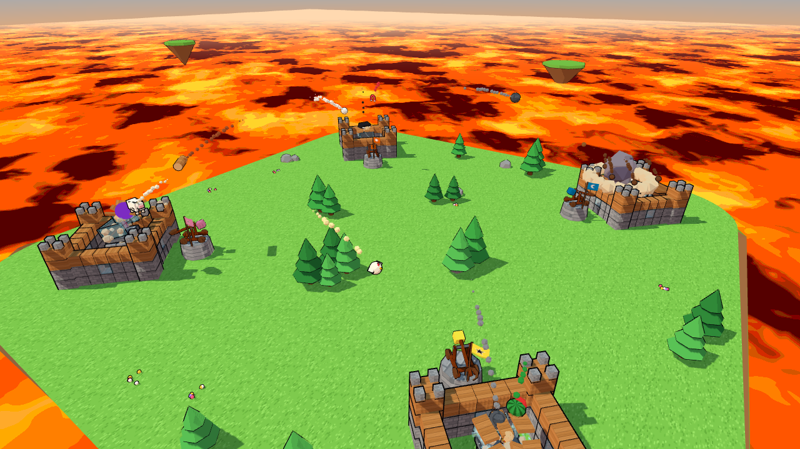
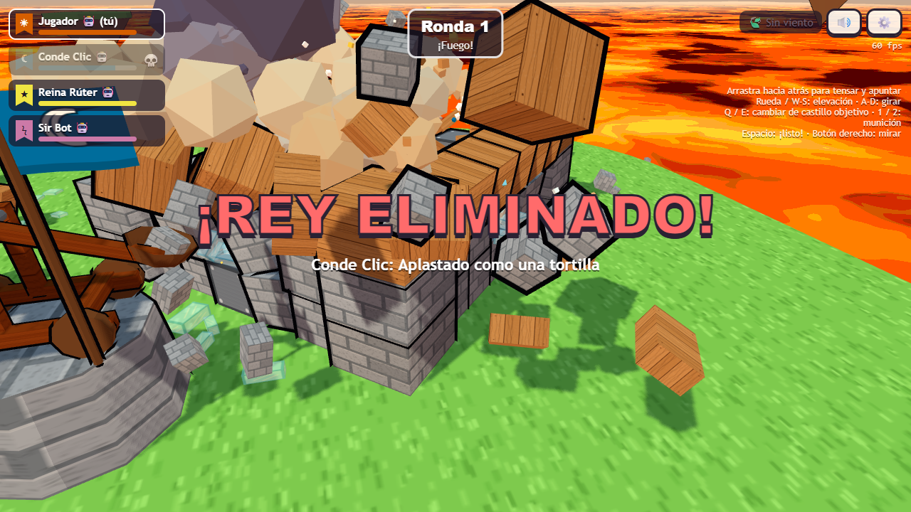
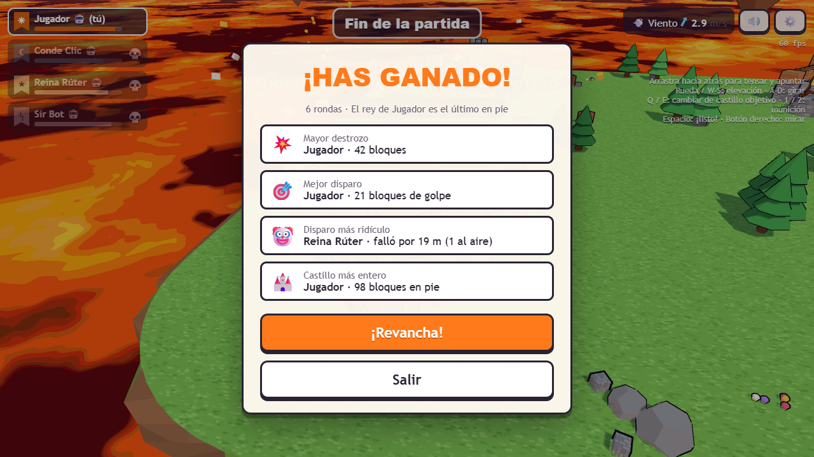

# Asedio Loco

Un "Angry Birds" en 3D de castillos y catapultas, en formato battle royale rápido, para el navegador. Hasta 4 jugadores, cada uno con su castillo de bloques con física real en una esquina de una isla sobre un mar de lava. Gana el último rey en pie.

**Jugar:** https://asedio-loco.dimasmijares.workers.dev

Sin cuentas ni instalaciones: crea una sala, copia el enlace y pásaselo a tus amigos. También puedes jugar solo contra bots (fácil, normal o difícil) o destrozar castillos en el campo de pruebas.



| | |
|---|---|
|  |  |

## Cómo se juega

- **Rondas simultáneas.** Todos apuntáis a la vez durante 20 s y disparáis soltando Espacio o el clic izquierdo. En cuanto todos estáis listos (o se acaba el tiempo), cuenta atrás: 3, 2, 1, ¡fuego!, mientras la cámara se aleja para verlo todo. Luego salen todos los disparos, escalonados para que se vean, y la física resuelve el destrozo.
- **Eliminación.** Un rey cae si sale despedido fuera de su castillo y toca el suelo, si lo aplastan o si toca la lava. Se ve al momento con confeti, un rótulo y la calavera en el marcador, y al acabar la ronda hay una repetición a cámara lenta de su caída.
- **Munición loca.** Cada ronda te tocan 3 municiones distintas al azar y eliges una; las que no usas se pierden. Son 12 tipos:
  - **Comunes:** pedrusco, tronco rodante, racimo de cocos (se divide en 4).
  - **Raras:** vaca explosiva, sandía pegajosa, gallina saltarina, piano (cae en vertical donde apuntes).
  - **Épicas:** agujero negro, imán (arranca el hierro), bola de nieve (crece al rodar).
  - **Defensivas:** andamio (reconstruye hasta 10 bloques) y burbuja (absorbe un impacto).
- **Escalada.** Cada 3 rondas sube la lava. Desde la ronda 10 inunda el patio y se come una hilera de cada castillo por nivel. Desde la ronda 6 sopla el viento, con una flecha que indica hacia dónde. Con 2 supervivientes, la munición es más rara.
- **Materiales.** La madera se astilla, la piedra aguanta, el cristal estalla en esquirlas y el hierro pesa mucho y casi no se rompe. Los bloques dañados se oscurecen.

## Controles

| Acción | Control |
|---|---|
| Apuntar | Mantén el **clic derecho** y mueve el ratón: a los lados gira, arriba y abajo cambia la elevación |
| Cargar y disparar | Mantén **Espacio** o el **clic izquierdo**: la fuerza sube de 0 a 100 % en 1,5 s y la parábola crece. Al soltar, el disparo queda listo y ya no cambia (también se puede mantener pulsado el botón de disparo) |
| Afinar | A / D (rumbo) · W / S (elevación). Mayúsculas: modo precisión |
| Cambiar de castillo objetivo | Q / E (o Tab) |
| Elegir munición | 1 / 2 / 3, también en el teclado numérico (o clic en la tarjeta) |
| Acercar o alejar la cámara | Rueda del ratón |
| Silenciar | M |
| Mostrar u ocultar la ayuda de controles | H |

Los puntos muestran solo el primer tramo del vuelo (sobre el 60 % mientras cargas), no dónde vas a caer. En Ajustes se puede cambiar la calidad gráfica (baja, media, alta), el sonido, el tamaño del texto, la sensibilidad del ratón al apuntar y si se muestran los fps.

## Desarrollo

```bash
npm install
npx playwright install chromium
npm run build && npx wrangler dev   # juego completo en http://localhost:8787
npm run dev                          # solo el cliente con Vite (portada, #solo, #sandbox)
```

- `npm test`: tests unitarios (Vitest).
- `npm run e2e`: pruebas E2E con Playwright en local. `npm run e2e:prod` las ejecuta contra producción.
- `GAMES=8 DIFF=normal npx vitest run --config tests/balance/vitest.config.ts`: simula partidas de bots para medir el equilibrio.
- Rutas útiles: `/#solo`, `/#sandbox` (munición infinita), `/#bench` (escena de rendimiento), `/#physics=ccd|tower|glass|fragments`.

La arquitectura, el protocolo de mensajes y cómo ejecutar cada prueba están en [CLAUDE.md](CLAUDE.md). Las decisiones de diseño, en [DECISIONES.md](DECISIONES.md).

## Despliegue

Todo va en **Cloudflare Workers** (plan gratuito, sin tarjeta):

- Un Worker sirve el cliente estático (Vite) y atiende `/api/rooms` y `/ws/<SALA>`.
- Cada sala es una **Durable Object** respaldada por SQLite que guarda el lobby y retransmite mensajes. La física la ejecuta el navegador del anfitrión de la sala.

Cada push a `main` pasa el typecheck y los tests, compila y despliega (`.github/workflows/deploy.yml`). Después ejecuta todas las pruebas E2E contra la URL pública. Hace falta:

- el secret `CLOUDFLARE_API_TOKEN` (token con solo el permiso *Workers Scripts: Edit*)
- la variable `CLOUDFLARE_ACCOUNT_ID`

Despliegue manual: `npx wrangler login` una vez y luego `npm run deploy`.

## Límites del plan gratuito (septiembre de 2026)

| Recurso | Límite | Uso aproximado del juego |
|---|---|---|
| Peticiones al Worker | 100.000/día | Unas pocas por partida (crear sala, abrir WebSocket) |
| Peticiones a Durable Objects | 100.000/día | Los mensajes WebSocket entrantes cuentan a razón de 20:1; una partida de unos 5 minutos con 4 humanos genera ~9.000 mensajes (≈ 450 peticiones) |
| Duración de Durable Objects | 13.000 GB·s/día | ≈ 40 GB·s por partida; las salas en espera hibernan y no cuentan |
| Archivos estáticos | Gratis e ilimitados | — |

En la práctica caben unas **200 partidas al día**. Los mensajes salientes no cuentan, así que el anfitrión los agrupa en un tic a 15 Hz para gastar poco.
